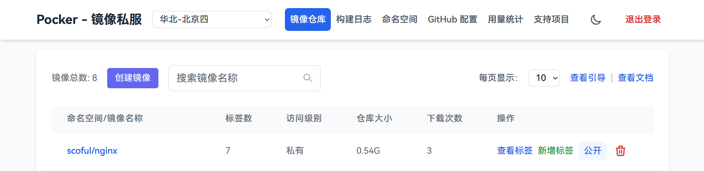

# Pocker

**_让每个人都有自己的 Docker 私服，Make Docker Great Again。_**

一个基于 Next.js 开发的全栈 Docker 镜像仓库管理系统，专为将 Docker Hub
镜像高效转存至华为云容器镜像服务（SWR）而设计。

支持一键部署，彻底解决镜像拉取缓慢问题，保障数据安全，让您完全掌控自己的 Docker
数据，我的 Docker 我做主。

## 体验地址
- https://pocker4u.vercel.app/
- 访问密钥：pocker4u

## 快速开始

### 部署

本项目支持通过 Vercel
一键部署，部署过程中需要配置环境变量，请看下一步简化版本或[详细图文步骤在线文档](https://pocker-doc.vercel.app/)

[](https://vercel.com/new/clone?repository-url=https%3A%2F%2Fgithub.com%2Fscoful%2Fpocker&env=ACCESS_KEY,GITHUB_TOKEN,HUAWEICLOUD_AK,HUAWEICLOUD_SK,NEXT_PUBLIC_HUAWEICLOUD_USERNAME,HUAWEICLOUD_PASSWORD&envDescription=%E4%B8%8A%E9%9D%A2%E7%9A%84%E7%8E%AF%E5%A2%83%E5%8F%98%E9%87%8F%E8%8E%B7%E5%8F%96%E6%96%B9%E6%B3%95%E8%AF%B7%E7%9C%8B%E2%86%92&envLink=https%3A%2F%2Fpocker-doc.vercel.app%2FquickStart%2FstepTwo&project-name=pocker&repository-name=pocker)

### 获取环境变量
**建议查看[获取环境变量在线文档](https://pocker-doc.vercel.app/quickStart/stepTwo)**
- ACCESS_KEY，系统登录凭证，请设置一个安全的密钥值，用于系统身份验证和访问控制
- GITHUB_TOKEN，访问[GitHub令牌设置](https://github.com/settings/tokens/new)创建一个新的访问令牌，有效期建议设置为永久，**_注意：权限仅需勾选 workflow 即可_**
- HUAWEICLOUD_AK，访问[华为云控制台](https://console.huaweicloud.com/iam/)获取ak，创建一个新的“用户组”并只授予**SWR FullAccess**权限，然后在这个用户组下创建一个新的“用户”，**_注意：创建时只需授予 SWR FullAccess 权限即可_**
- HUAWEICLOUD_SK，访问[华为云控制台](https://console.huaweicloud.com/iam/)获取sk，**_注意：与HUAWEICLOUD_AK配套使用，同样只需授予 SWR FullAccess 权限_**
- NEXT_PUBLIC_HUAWEICLOUD_USERNAME，访问[华为云容器镜像服务](https://console.huaweicloud.com/swr)获取**长期有效登录指令**，通过上一步获取的AK和SK获取，只需要-u的值
- HUAWEICLOUD_PASSWORD，访问[华为云容器镜像服务](https://console.huaweicloud.com/swr)获取**长期有效登录指令**，通过上一步获取的AK和SK获取，只需要-p的值

### 配置自动更新

1. 打开你在 Vercel 上部署后获得的项目地址，进入"GitHub 配置"菜单下的"配置自动更新"，填写您在 Vercel 上部署的项目名称（例如：pocker）。该项目名可在
   Vercel 控制台查看，它对应着您 GitHub 账号下的一个私有仓库。
2. 打开 Vercel 项目控制面板，进入 Settings → Environment → 点击 Production，跳转后把 Branch Tracking 的 master 改成 main
   ，最后保存
3. 完成以上配置后，系统将自动同步最新功能和更新

### 修改 Vercel 环境变量（可选）
**每次修改后要重新部署才能生效**
1. 在 Vercel 项目控制面板中，进入 Settings → Environment Variables 页面
2. 可以看到上述配置的所有环境变量
3. 修改后，点击 Redeploy 重新部署项目
4. 部署完成后即可开始使用系统，尽情体验吧！

## 系统截图

<div align="center">
  
  
</div>

## 详细文档

- [在线文档](https://pocker-doc.vercel.app/)

## 主要功能

- 🔐 密钥验证登录
- 🌍 支持多区域切换，轻松获取全球各地的容器镜像资源，目前支持全球23个地方节点
- 📦 镜像仓库管理
    - 创建/删除镜像仓库
    - 搜索镜像
    - 公开/私有仓库切换
- 🏷️ 标签管理
    - 查看镜像标签列表
    - 创建新标签（基于已有镜像）
    - 删除标签
    - 搜索标签
    - 复制标签pull地址
- 👥 命名空间管理
    - 创建/删除命名空间
    - 查看命名空间列表
- 📊 用量统计查看
    - 查看命名空间数量、镜像仓库数量、标签数量、存储空间大小、下行流量大小
- ⚙️ GitHub Actions 自动化
    - 自动创建/配置用于中转的 GitHub 仓库
    - 自动配置用于中转的工作流
    - 查看构建日志
- 🌓 支持暗黑模式
- 🎯 新手引导功能
- 🔄 自动版本检测与更新：支持新版本提醒，可选择自动更新模式，开启后系统将自动静默完成更新

## 技术栈

- Next.js (Pages Router)
- Tailwind CSS
- Driver.js (新手引导)
- GitHub API
- 华为云 SDK

## 环境要求

- Node.js 16+
- 华为云账号密钥
- GitHub 账号密钥

## 开发

```bash
# 安装依赖
npm install

# 开发环境运行
npm run dev

# 构建
npm run build

# 生产环境运行
npm start
```

## TODO

- ~~开发阿里云版本(已放弃,因阿里云免费版不支持SDK调用)~~
- ~~开发腾讯云版本（已完成，但发现速度受限，已放弃）~~
- 开发华为云版（已完成）


## 许可证

MIT

## ❤️ 支持项目

如果这个项目对你有帮助，欢迎请作者喝杯瑞幸，一杯在手，幸运共有 ☕

<div align="center">
  
  
</div>

## Star 趋势

[](https://starchart.cc/scoful/pocker)

You are my th visitor
