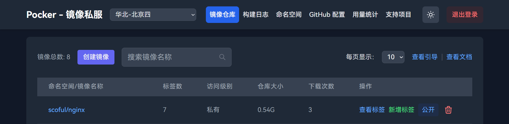

# Pocker
**_让每个人都有自己的 Docker 私服，Make Docker Great Again。_**

一个基于 Next.js 开发的全栈 Docker 镜像仓库管理系统，专为将 Docker Hub 镜像高效转存至腾讯云容器镜像服务（TCR）个人版而设计。支持一键部署，彻底解决镜像拉取缓慢问题，保障数据安全，让您完全掌控自己的 Docker 环境，我的 Docker 我做主。

## 快速开始
### 部署

本项目支持通过 Vercel 一键部署。

[](https://vercel.com/new/clone?s=https%3A%2F%2Fgithub.com%2Fscoful%2Fpocker&showOptionalTeamCreation=false)

### 获取环境变量

- ACCESS_KEY，系统登录凭证，请设置一个安全的密钥值，用于系统身份验证和访问控制
- Region，建议直接填：**ap-guangzhou**
- TENCENTCLOUD_SECRET_ID，访问[腾讯云控制台](https://console.cloud.tencent.com/cam)创建并获取SecretId，**_注意：创建时只需授予 QcloudTCRFullAccess 权限即可_**
- TENCENTCLOUD_SECRET_KEY，访问[腾讯云控制台](https://console.cloud.tencent.com/cam)获取SecretKey，**_注意：与SecretId配套使用，同样只需授予 QcloudTCRFullAccess 权限_**
- TENCENTCLOUD_PASSWORD，访问[腾讯云容器镜像服务](https://console.cloud.tencent.com/tcr)控制台，填写您在初始化容器镜像服务时设置的登录密码。
- GITHUB_TOKEN，访问[GitHub令牌设置](https://github.com/settings/tokens/new)创建一个新的访问令牌，有效期建议设置为永久，**_注意：权限仅需勾选 workflow 即可_**

### 设置Vercel环境变量
1. 点击右边一键部署按钮 [](https://vercel.com/new/clone?s=https%3A%2F%2Fgithub.com%2Fscoful%2Fpocker&showOptionalTeamCreation=false) 完成初始部署
2. 在Vercel项目控制面板中，进入 Settings → Environment Variables 页面
3. 将上述获取的所有环境变量依次添加到配置中
4. 添加完成后，点击 Redeploy 重新部署项目
5. 部署完成后即可开始使用系统，尽情体验吧！

## 系统截图
<div align="center">
  
  
</div>

## 详细文档
- 写作ing

## 主要功能

- 🔐 密钥验证登录
- 📦 镜像仓库管理
    - 创建/删除镜像仓库
    - 批量删除仓库
    - 搜索镜像
    - 公开/私有仓库切换
- 🏷️ 标签管理
    - 查看镜像标签列表
    - 创建新标签（基于已有镜像）
    - 删除标签
    - 搜索标签
    - 批量删除标签
    - 复制标签pull地址
- 👥 命名空间管理
    - 创建/删除命名空间
    - 查看命名空间列表
- 📊 配额信息查看
  - 查看命名空间、镜像仓库、标签的已用数和总可用数对比
- ⚙️ GitHub Actions 自动化
    - 自动创建/配置 GitHub 仓库
    - 自动配置工作流
    - 查看构建日志
- 🌓 支持暗黑模式
- 🎯 新手引导功能

## 技术栈

- Next.js (Pages Router)
- Tailwind CSS
- Driver.js (新手引导)
- GitHub API
- 腾讯云 API

## 环境要求

- Node.js 16+
- 腾讯云账号密钥
- GitHub 账号密钥

## 开发

```bash
# 安装依赖
npm install

# 开发环境运行
npm run dev

# 构建
npm run build

# 生产环境运行
npm start
```
## TODO
- ~~开发阿里云版，阿里云免费版不支持sdk~~
- 开发华为云版
- 其他云

## 许可证

MIT

## ❤️ 支持项目

如果这个项目对你有帮助，欢迎请作者喝杯瑞幸，一杯在手，幸运共有 ☕

<div align="center">
  
  
</div>

## Star 趋势
[](https://starchart.cc/scoful/pocker)

You are my th visitor
